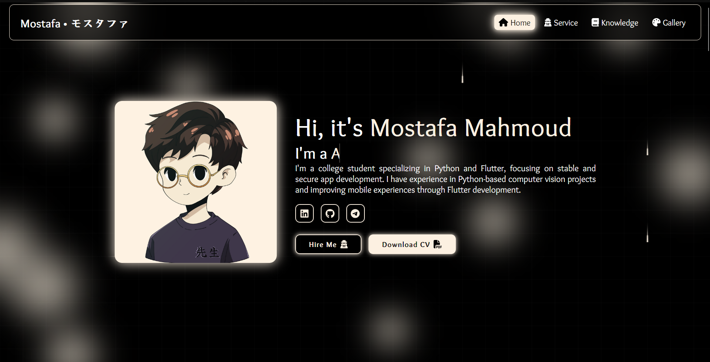

<h1 align="center">Ahmed Emad (0x3omda) - Cybersecurity Portfolio</h1>
<p align="center"></p>
<p align="center">
  <strong>Computer Science Student | CCNA Engineer | Information Security & Digital Forensics Specialist</strong>
</p>
<p align="center">
  <a href="#about">About</a> •
  <a href="#features">Features</a> •
  <a href="#tech-stack">Tech Stack</a> •
  <a href="#getting-started">Getting Started</a> •
  <a href="#performance">Performance</a> •
  <a href="#contributing">Contributing</a> •
  <a href="#license">License</a>
</p>

---

## About

Welcome to my personal portfolio - a modern, performant showcase of my work in **Software Development**, **Cybersecurity**, and **Digital Forensics**. Built with cutting-edge web technologies, this portfolio demonstrates both technical skills and creative problem-solving.

**Key Highlights:**
- 🎓 Computer Science Student at BFCAI
- 🔐 Certified CCNA Engineer
- 🛡️ Specializing in Information Security & Digital Forensics
- 🚀 Full-stack Development Experience

## Features

✨ **Advanced Features:**

1. **High-Performance Design**
   - GPU-accelerated animations with `translateZ(0)`
   - CSS containment for optimized rendering
   - Lazy loading of components
   - Next.js 16 with App Router

2. **Fully Responsive Layout**
   - Mobile-first design
   - Supports all modern browsers
   - Touch-optimized interactions
   - Accessible navigation

3. **Interactive Project Showcase**
   - Dynamic project filtering
   - Lightbox gallery with smooth animations
   - Project categorization
   - Live demo links

4. **Modern Tech Stack**
   - React 19 with TypeScript
   - Next.js 13+ App Router
   - Framer Motion for animations
   - FontAwesome icons
   - CSS Modules for styling

5. **SEO & Performance Optimized**
   - Meta tags and Open Graph
   - XML Sitemap & Robots.txt
   - Image optimization
   - Zero JavaScript hydration mismatches
   - Core Web Vitals optimized

6. **Specialized Sections**
   - Professional Experience Timeline
   - Skills & Expertise
   - Project Portfolio
   - Art Gallery
   - Direct Contact Form
## Getting Started

### Prerequisites
- Node.js 18.17 or later
- npm 9+ or yarn 4+

### Installation

1. **Clone the repository:**
   ```bash
   git clone https://github.com/Eng-Ahmed-Emad/AhmedEmad-Dev.git
   cd AhmedEmad-Dev
   ```

2. **Install dependencies:**
   ```bash
   npm install
   # or
   yarn install
   ```

3. **Set up environment variables:**
   ```bash
   cp .env.example .env.local
   ```
   
   Edit `.env.local` with your configuration.

4. **Run development server:**
   ```bash
   npm run dev
   # or
   yarn dev
   ```

5. **Open your browser:**
   Navigate to [http://localhost:3000](http://localhost:3000)

### Build for Production

```bash
npm run build
npm start
```

## Tech Stack

**Frontend:**
- **Next.js 16** - React framework with App Router
- **React 19** - UI library
- **TypeScript** - Type-safe development
- **Framer Motion** - Advanced animations
- **FontAwesome** - Icon library
- **CSS Modules** - Scoped styling

**Performance:**
- **GPU Acceleration** - Transform & backface-visibility optimizations
- **CSS Containment** - Layout isolation
- **Next/Font** - Optimized Google Fonts loading

**Development:**
- **ESLint + TypeScript** - Code quality
- **CSS Variables** - Dynamic theming

## Performance

### Optimizations Implemented

✅ **Rendering Performance:**
- GPU-accelerated transforms with `translateZ(0)`
- CSS containment for paint/layout isolation
- Backface visibility to prevent flickering
- Specific transition properties (no `transition: all`)
- Strategic `will-change` usage

✅ **Loading Performance:**
- Next/Font for optimized typography loading
- Static export for fast deployments
- Image optimization with next/image
- Minified CSS and JavaScript

✅ **Best Practices:**
- Hydration mismatch prevention
- localStorage checks for SSR safety
- Responsive design with mobile-first approach
- Accessibility support (prefers-reduced-motion)
- SEO-optimized with meta tags & sitemap

### Core Web Vitals
- **LCP** (Largest Contentful Paint): < 2.5s
- **FID** (First Input Delay): < 100ms  
- **CLS** (Cumulative Layout Shift): < 0.1

## Contributing

Contributions are welcome! Please follow these steps:

1. Fork the repository
2. Create a feature branch (`git checkout -b feature/amazing-feature`)
3. Commit your changes (`git commit -m 'Add amazing feature'`)
4. Push to the branch (`git push origin feature/amazing-feature`)
5. Open a Pull Request

Please ensure:
- Code follows the existing style
- TypeScript types are properly defined
- ESLint passes (`npm run lint`)
- Components are documented

## License

This project is licensed under the MIT License - see the [LICENSE](LICENSE) file for details.

## Contact

📧 **Email:** [Your Email]
🔗 **LinkedIn:** [Your LinkedIn Profile]
🐙 **GitHub:** [@Eng-Ahmed-Emad](https://github.com/Eng-Ahmed-Emad)
🌐 **Website:** [https://ahmedemad-dev.com](https://ahmedemad-dev.com)

---

<p align="center">
  <strong>Made with ❤️ by Ahmed Emad (0x3omda)</strong>
</p>## Contributing
Your contributions are welcome! Here's how you can help improve Eng-Ahmed-Emad(0x3omda) Dev :

1. Fork the repository
2. Create your feature branch: `git checkout -b feature/AmazingFeature`
3. Commit your changes: `git commit -m 'Add some AmazingFeature'`
4. Push to the branch: `git push origin feature/AmazingFeature`
5. Open a pull request

For major changes, please open an issue first to discuss what you would like to change.

## License
This project is licensed under the GPL-3.0 license - see the [LICENSE](LICENSE) file for details.

---

<p align="center">
  Made with ❤️ by <a href="https://github.com/Eng-Ahmed-Emad">Ahmed Emad </a>
</p>